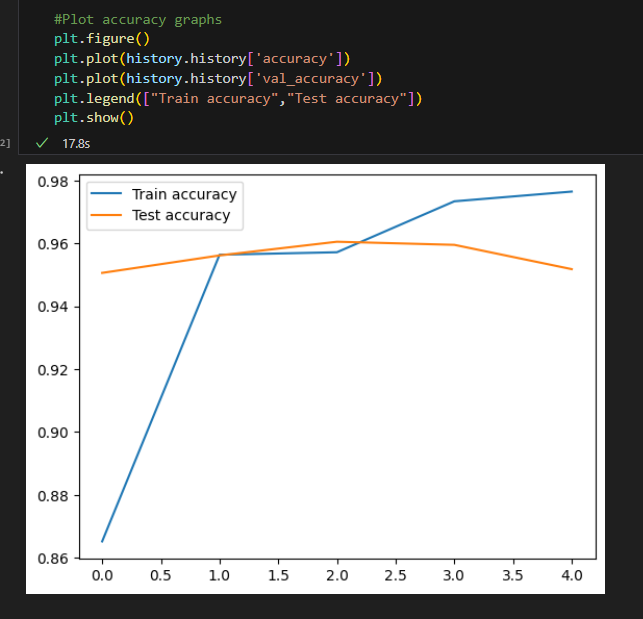
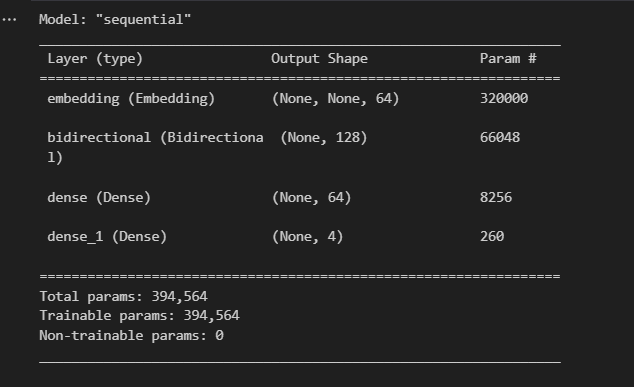
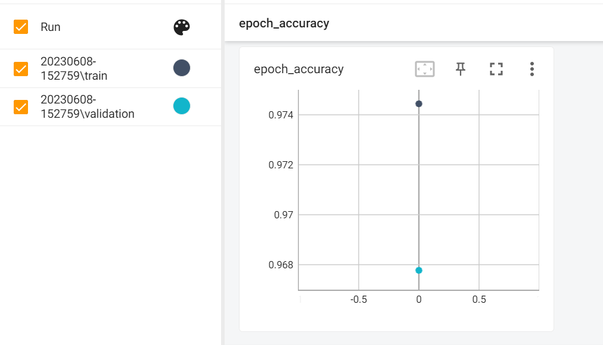
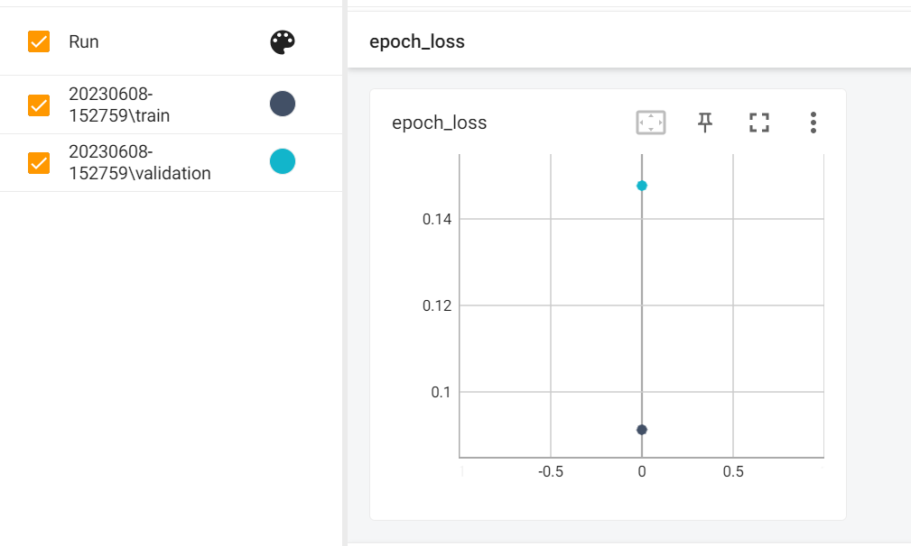

# E-commerce Product Categorization
## Project Description
The project aims to develop a machine learning model using Long Short-Term Memory (LSTM) for categorizing unseen products into four categories: "Electronics", "Household", "Books", and "Clothing & Accessories". The model is trained on a dataset obtained from Ecommerce Text Classification. The project involves data preprocessing, model development using TensorFlow, training, evaluation, and visualization using Tensorboard. The goal is to develop a machine learning model using LSTM that achieves an accuracy of more than 85% and an F1 score of more than 0.7.
## Project Functionality
- Utilizes LSTM model to classify product texts into categories.
- Handles challenges related to data preprocessing and text classification.
- Saves the trained model and tokenizer for future use.
- Visualizes the model graph and training progress using Tensorboard.
## Challenges and Solutions
### Challenge: 
Data Preprocessing and Cleaning
### Solution: 
Pandas library is used to read and process the data, performing necessary data cleaning and exploratory data analysis.
### Challenge: 
Text classification and achieving desired accuracy and F1 score
### Solution: 
An LSTM model is developed using TensorFlow, with appropriate architecture and hyperparameter tuning, to achieve an accuracy of more than 85% and an F1 score of more than 0.7.
## Future Implementations
- Implementing additional features for improved model performance.
- Enhancing the preprocessing pipeline for better text representation.
- Exploring advanced LSTM architectures and techniques for better classification accuracy.
## How to Install and Run the Project
### 1. Clone the repository to your local machine using the following command:
```shell
git clone <repository_url>
```
### 2. Before running the code, ensure that you have the following dependencies installed:
- TensorFlow
- Pandas 1.5.3
- Matplotlib
- Tensorboard 2.12.3

Install the required dependencies by running the following command:
```shell
pip install tensorflow==2.12.0
pip install numpy==1.24.2
pip install matplotlib==3.7.1
pip install pandas==1.5.3
pip install tensorboard===2.12.3
```
### 3. Download the dataset from the provided Kaggle link and place it in the project directory.
### 4. Open the Jupyter Notebook or Python script containing the code.
### 5. Run the code cells or execute the script to perform data preprocessing, model training, and evaluation.
### 6. Use Tensorboard to visualize the model graph and training progress by running the following command in the project directory:
```shell
tensorboard --logdir tensorboard_logs/capstone2
```
Access Tensorboard in your web browser using the provided URL.
### 7. The trained model will be saved in the "saved_models" folder in .h5 format as model.h5
## Project Requirements
- Python
- TensorFlow library
## Usage
- Download the dataset from https://www.kaggle.com/datasets/saurabhshahane/ecommerce-text-classification and place it in the data directory.
- Preprocess the data using the provided Jupyter notebook farah-capstone2-ecommerce.ipynb.
- Train the LSTM model using the notebook farah-capstone2-ecommerce.ipynb. The notebook includes steps for training, evaluating and saving the model.
- To visualize the training process and performance, you can launch TensorBoard using the following command:
  tensorboard --logdir capstone_assignment_2
- Access the TensorBoard dashboard by opening a web browser and navigating to the provided URL.
- To categorize unseen products using the trained model, you can use the notebook farah-capstone2-ecommerce.ipynb. It provides an example of how to load the saved model and perform predictions on new data.
## Results
You can also find the screenshots of the model architecture, training process and performance reports in the results directory. These images provide an overview of the project's progress and results.
The project generates the following outputs:

- Model performance:



- Model Architecture:



- Tensorboard Accuracy:



- Tensorboard Loss:



- The trained model achieved a training accuracy of 97.65% and a validation accuracy of 95.18%. The low training loss of 0.0905 indicates that the model effectively minimized the difference between predicted and actual values during the training phase. Similarly, the validation loss of 0.2122 demonstrates good performance on unseen data.
- These results indicate that the model has learned to categorize products into the desired categories with high accuracy. However, it's important to note that there is a slight difference between the training and validation accuracies, suggesting a potential overfitting on the training data. Further fine-tuning and regularization techniques can be explored to improve generalization on unseen data.
- The F1 score obtained 0.952006628045495 indicates that the model has achieved a high level of accuracy in categorizing the products into the desired categories. This suggests that the model has a good balance between correctly identifying positive instances and avoiding false positives and false negatives.
- The model's performance meets the project requirements, achieving an accuracy of more than 85% and an F1 score of more than 0.7. The model's architecture and performance plots can be found in the directory and the trained model is saved in the 'saved_models' directory in .h5 format.
- For more details and instructions on how to run the project, please refer to the 'Usage' section in this README file.
## Credits
The dataset used in this project is sourced from Kaggle:
https://www.kaggle.com/datasets/saurabhshahane/ecommerce-text-classification

## Contributing
Contributions to this project are welcome. If you find any issues or have suggestions for improvement, please open an issue or submit a pull request on the GitHub repository.
